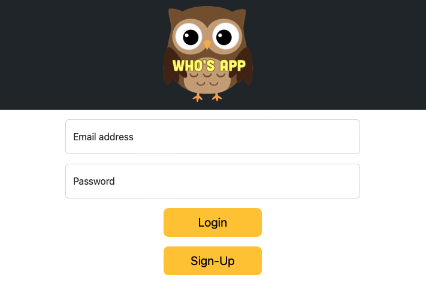
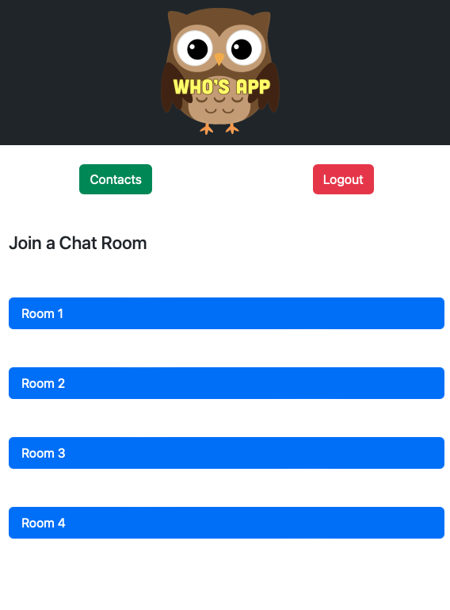
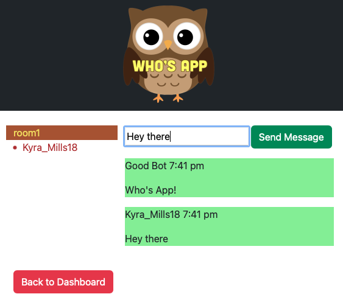

# Who's App
The newest chat app in town!

## Table of Contents

- [Description](#description)
- [Motivation](#motivation)
- [User Story](#user-story)
- [Technologies](#Technologies)
- [Deployed Application](#deployed-application)
- [Future Improvements](#future-improvements)
- [Installation](#installation)
- [Usage](#usage)
- [Credits](#credits)
- [License](#license)

## Description

Privacy is hard to come by these days, especially online. Your data is sold from company to company like a current down the river and we wanted to bring back some anonymity to our daily social life. Our Who’s App is just that: Who is it that you’ll be talking to? You’ll never know with individual chat rooms established to talk to anyone else in the room, and then upon exit the messages are obliterated.

## Motivation

To provide a fun, fast, free, and secure way of chatting with people from around the world

## User Story

As a user
I want to chat with other people across the world
So I can have secure and anonymous conversations

## Acceptance Criteria 

GIVEN a user want to chat with someone else

WHEN I open the webpage,

THEN I am asked to sign up or log in

WHEN I sign up or log in,

THEN my credentials are saved to my device

WHEN I see the main chat page,

THEN I see a list of all of my contacts 

WHEN I open one chat message

THEN I am presented with the ability to chat and can also see the chat history

## Technologies

- Node.js for back-end development
- Express.js for the REST API and session
- MySQL to store date to
- Sequelize to send objects
- Faker.js data to seed the database
- Socket.io to communication between clients
- Handlebars.js to create the webpage
- Heroku to host the app

## Deployed Application

This challenge is deployed to Heroku: [https://whooooos-app.herokuapp.com/dashboard]

and housed on Github: [https://github.com/miss-mad/Whos-App]

## Future Improvements

* Save messages to a database for message history - this changes the anonymous nature of the app, however
* Allowing users to choose a contact and enter into a chat room with that single contact only

## Installation

```
clone github repo
npm install
node server.js

Go to http://localhost:3001
```
OR follow the above heroku deployed application link

## Usage

Below are screenshots of Who's App.

- User chooses to log in or sign up  

- Chat rooms that are available to the user 

- Chat with another user


## Credits

Collaborators:

Group 1 
 [Madeleine Harris](https://github.com/miss-mad)
 [Hunter O'Neal](https://github.com/HellaHunter)
 [Matthew Shahamad](https://github.com/MatthewShahamad)
 [Emilio Acosta-Galicia](https://github.com/EmilioAcostaG)
 [Horatious Harris](https://github.com/geekcoldhand)

## License

No licenses

---
